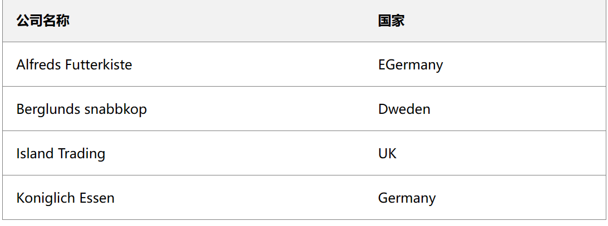
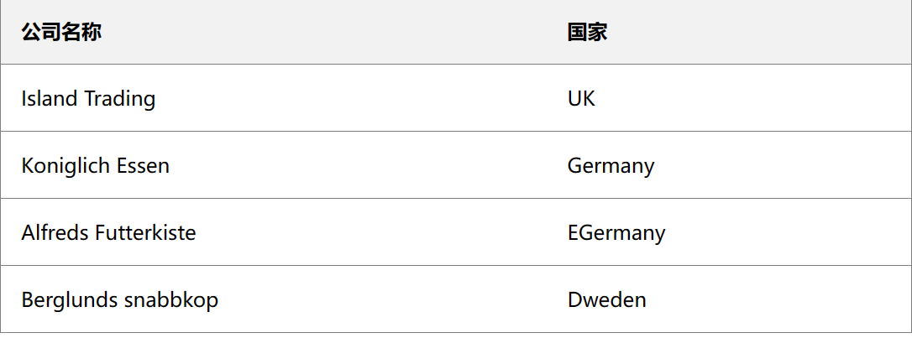
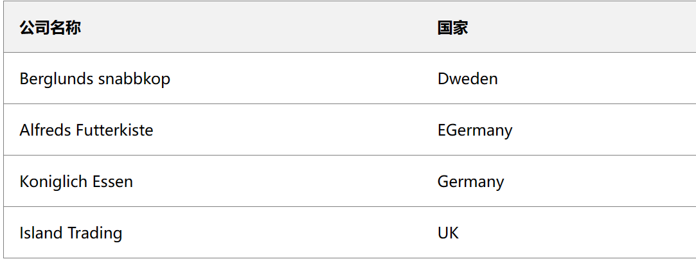
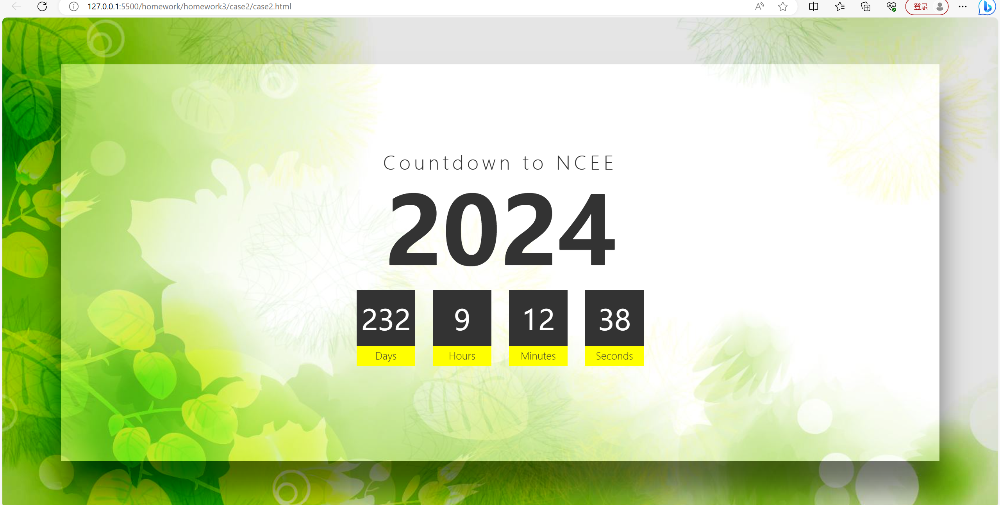
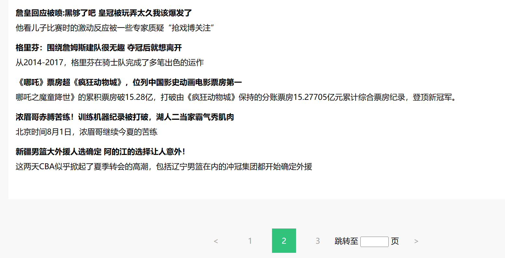

# <span style="color:#00fbfb">第三次大作业</span>
>熟悉编写js代码的方式  
>对js代码各种分支语句以及变量处理进行练习  
## <span style="color:green">第 1 题：实现表格排序功能</span>
### <span style="color:#f0a">核心代码分析</span>

```js
function sortTable(n) {
  var table,
    rows,
    switching,
    i,
    x,
    y,
    shouldSwitch,
    dir,
    switchcount = 0;
  table = document.getElementById("msg");
  switching = true;
  // 设置升序排列
  dir = "asc";
  /* 设置一个循环语句 */
  while (switching) {
    // 设置循环结束标记
    switching = false;
    rows = table.rows;
    /* 循环列表，从第二行开始 */
    for (i = 1; i < rows.length - 1; i++) {
      // 设置元素是否调换位置
      shouldSwitch = false;
      /* 获取要比较的元素,
                    one from current row and one from the next: */
      x = rows[i].getElementsByTagName("TD")[n];
      y = rows[i + 1].getElementsByTagName("TD")[n];
      /* 判断是否将下一个元素与当前元素进行切换 (asc 或 desc):  */
      if (dir == "asc") {
        if (x.innerHTML.toLowerCase() > y.innerHTML.toLowerCase()) {
          // 设置调换元素标记，并结束当前循环
          shouldSwitch = true;
          break;
        }
      } else if (dir == "desc") {
        if (x.innerHTML.toLowerCase() < y.innerHTML.toLowerCase()) {
          // 设置调换元素标记，并结束当前循环
          shouldSwitch = true;
          break;
        }
      }
    }
    if (shouldSwitch) {
      /* 如果元素调换位置设置为 true，则进行对调操作 */
      rows[i].parentNode.insertBefore(rows[i + 1], rows[i]);
      switching = true;
      // 每次对调完成时，将 switchcount 增加 1
      switchcount++;
    } else {
      /* 如果完成所有元素的排序且 direction 设置为 "asc",这时就将 direction 设置为 "desc" 并再次执行循环 */
      if (switchcount == 0 && dir == "asc") {
        dir = "desc";
        switching = true;
      }
    }
  }
}
```

### <span style="color:#f0a">效果展示</span>

#### 公司名排序1次

#### 公司名排序2次

#### 国家缩写排序1次

#### 国家缩写排序2次

## <span style="color:green">第 2 题：用 JS+CSS 实现高考倒计时</span>

> <span style="color:red">要求：对 JS、CSS 关键代码添加注释。</span>

### <span style="color:#f0a">核心代码分析</span>

```css
.container {
    /*设置位置为绝对位置，并设置具体值*/
    position: absolute;
    top: 80px;
    left: 100px;
    right: 100px;
    bottom: 80px;
    /*设置背景元素*/
    background: url(bg.jpg);
    background-attachment: fixed;
    display: flex;/*设置元素属性*/
    justify-content: center;
    align-items: center;
    flex-direction: column;
    /*盒子模型阴影设置*/
    box-shadow: 0 50px 50px rgba(0, 0, 0, 0.5), 0 0 0 100px rgba(0, 0, 0, 0.1);
}
.countdown div {/*设置.countdown类下的div标签*/
    /*设置位置为相对位置*/
    position: relative;
    width: 100px;
    height: 100px;
    line-height: 100px;
    text-align: center;/*居中对齐*/
    background: #333;
    color: #fff;/*颜色设置*/
    margin: 0 15px;/*外边距设置*/
    font-size: 3em;
    font-weight: 500;
}
.countdown div:before {/*设置.countdown类下的div标签
             伪类before before和::after下特有的content，
             用于在css渲染中向元素逻辑上的头部或尾部添加内容。 */
    content: "";
    /*设置位置为绝对位置，并设置具体值*/
    position: absolute;
    bottom: -30px;
    left: 0;
    width: 100%;
    height: 35px;

    background: #ff0;
    color: #333;
    font-size: 0.35em;/*字体大小设置 rem 保证兼容性*/
    line-height: 35px;/*设置行高*/
    font-weight: 300;
}
```
```js
//初始加载时间
window.onload = countDown;
//获取系统时间
function getEndTime(myYear) {
  var myEndTime = new Date("" + myYear + "/06/07 00:00:00");
  return myEndTime;
}
function countDown() {
  var mydate = new Date();
  var year = "2024";
  var EndTime = getEndTime(year);
  var NowTime = new Date();
  if (EndTime.getTime() - NowTime.getTime() < 0) {
    year = mydate.getFullYear() + 1;
    EndTime = getEndTime(year);
  }
  //算出实际剩余时间
  var t = EndTime.getTime() - NowTime.getTime();
  //分别换算时间
  var d = Math.floor(t / 1000 / 60 / 60 / 24);
  var h = Math.floor((t / 1000 / 60 / 60) % 24);
  var m = Math.floor((t / 1000 / 60) % 60);
  var s = Math.floor((t / 1000) % 60);
  //修改内部时间
  document.getElementById("day").innerText = d;
  document.getElementById("hour").innerText = h;
  document.getElementById("minute").innerText = m;
  document.getElementById("second").innerText = s;
}
setInterval(countDown, 1000); //每间隔一秒调用异常countDown函数刷新时间
```

### <span style="color:#f0a">效果展示</span>


## <span style="color:green">第 3 题：完成模板渲染和分页功能</span>

### <span style="color:#f0a">核心代码分析</span>

```js
//【需要完成代码1】：此处实现新闻模板内容的渲染
for (var Ele of newsDataRender) {
//向news中添加tpl模版实际产生的HTMl元素即可
  news.innerHTML += tpl
    .replace("{{title}}", Ele.title)//实际title替换
    .replace("{{content}}", Ele.content);//实际content替换
}
//【需要完成代码2】：此处实现输入页码回车跳转
skipInput.addEventListener("keypress", (event) => {
  if (event.key == "Enter") {
    p = event.target.value;//监听是否按下回车键，是则读取新p值
    renderNews();//调用刷新一下页面
    changePageClass(p);//修改下部页面显示
  }
});
```
### <span style="color:#f0a">效果展示</span>

